# Procedural City

**University of Pennsylvania, CIS 566**
* Jiawei Wang
* Pennkey: jiaww
* Tested on: Windows 10, i7-6700 @ 2.60GHz 16.0GB, GTX 970M 3072MB (Personal)
___

## Overview
[Demo Link](https://jiaww.github.io/homework-5-shape-grammar-city-Jiaww/)

The goal of this project is to model an urban environment using a shape grammar. Although the project is only a one-week work, the details are pretty simple and direct. 

Here are the final results:

|**Final Result(Seed = 24860)**|
|---|
||

|**Without Texture**|**Population Density**|
|---|---|
|||

## Symbol Node
 Symbol node class to include attributes necessary for rendering, such as
``` javascript
class Shape{
    constructor(public predecessor: Shape, public symbol:string, public geometry:string, 
        public pos:vec3, public rot:vec3, 
        public scale:vec3, public xaxis:vec3, public zaxis:vec3){
        this.predecessor = predecessor; // predescessor shape
        this.symbol = symbol; // symbol for rule
        this.geometry = geometry; // geometry for rendering
        this.pos = pos; 
        this.rot = rot;
        this.scale = scale;
        this.xaxis = xaxis;
        this.zaxis = zaxis;
    }
}
```

## Grammar design
* I designed 5 different buildings, they are:
    * Building 1: **Rotating Skyscraper**
        * the model is combined by 4 parts: base, middle, window and roof.
        * the height is decided by the iteration times.
        * the number of the windows for each floor is random(3 or 4).
        * the rotation of each floor is also random.
        
        |**iteration=0**|**iteration>0**|
        |---|---|
        |||
    
    * Building 2: **Circular Mall**
        * the model is combined by 4 parts: base, middle, window and roof.
        * the height is decided by the iteration times.
        * the windows are around its outer surface
        
        |**iteration=0**|**iteration>0**|
        |---|---|
        |||
        
    * Building 3: **Serrated Building**
        * the model is combined by 4 parts: base, middle, window and roof.
        * the height is decided by the iteration times.
        * each middle floor is combined by 3 different blocks with different colors.
        * each block has 2 rows of different windows. 
        * the nearby blocks are serrated which makes them artisitic on structure.
        
        |**iteration=0**|**iteration>0**|
        |---|---|
        |||   
 
    * Building 4: **Little House**
        * the model is combined by 2 parts: base, and roof.
        * the height is constant (=1).
        * the house can have extra blocks at three directions with the iteration increasing: when iteration increase, the grammar will randomly choose a direction and have a certain probility to extend.
        * each block's scale is random between certain range.
        * combined these togther, we can get lots of different results of the house.
        
        |**iteration=0**|**iteration>0**|**iteration>>0**|
        |---|---|---|
        |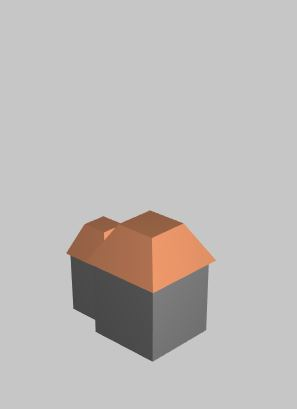|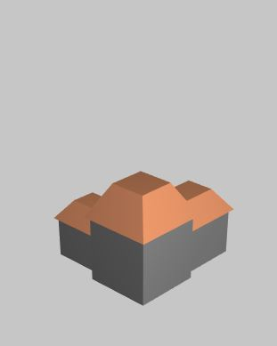|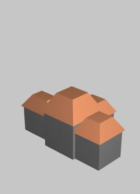|
        
    * Building 5: **Tower of Babel**
        * the model is combined by 4 parts: base, middle, window and roof.
        * the height is decided by the iteration times.
        * each floor has a window facing random direction.
        
        |**iteration=0**|**iteration>0**|
        |---|---|
        |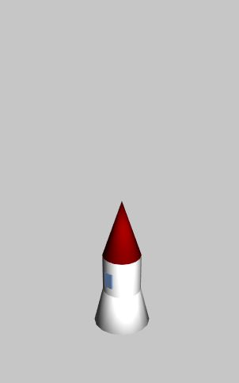|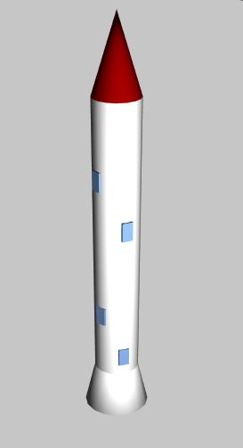|   
 
* The renderer is pretty similar to the previous project(**L-System Tree**): pass all models' world-space vertices info into shader.

## Create a city
* To create a city, here I am using the **2D Perlin Noise** to generate the terrain, and the intensity of the noise represent the population density.
* The bigger the value of the position on density map, the larger the population there is, which means the higher the building is.
* Besides, due to the different features of my building design, I determine the building distribution rules as follow:
  * `curDensity > 1.4`: add building **Tower of Babel**.
  * `0.5 < curDensity < 1.4`: add building **Rotating Skyscraper**.
  * `0.2 < curDensity < 0.5`: add building **Serrated Building**.
  * `0.1 < curDensity < 0.2`: 80% add building **Serrated Building**, 20% add building **Circular Mall**. 
  * `0.05 < curDensity < 0.1`: add building **Little House**.
  * `curDensity < 0.05`: Nothing(Road).
* Here are the example generation when `seed = 24860`:

  |**Perlin Noise**|**Top View of the City**|
  |---|---|
  |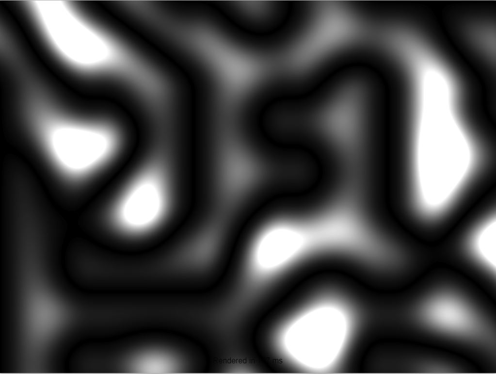|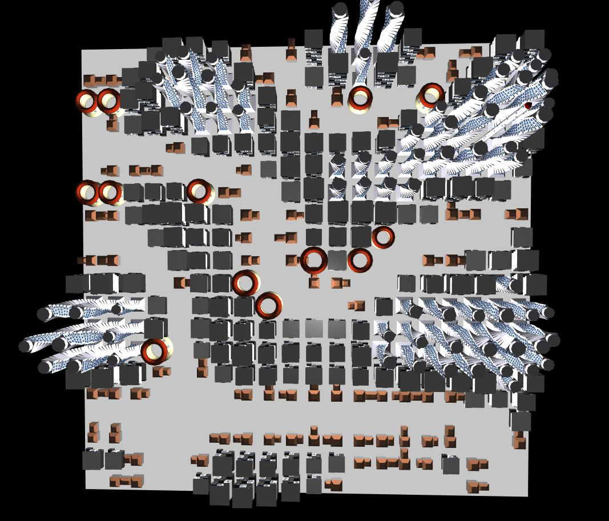|

* You can change the **iteration** times using GUI to change the generations of the buildings.

  |**iter=4**|**iter=20**|**iter=30**|
  |---|---|---|
  |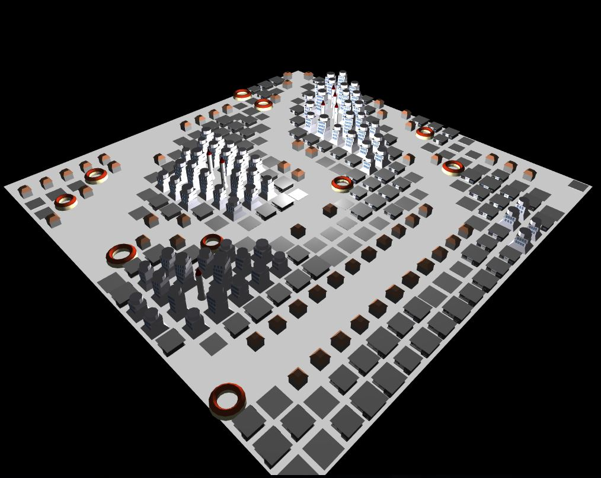|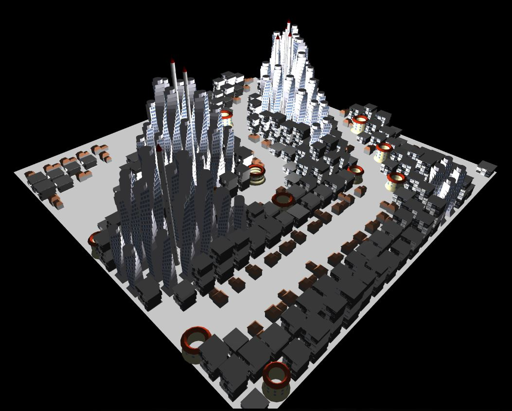|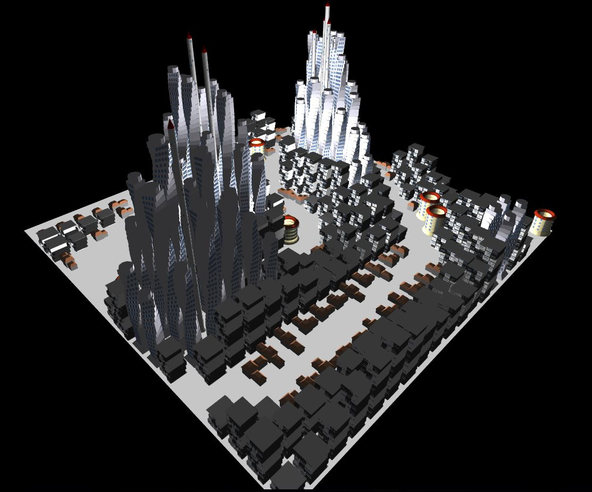|

* You can change the **TerrainSeed** using GUI to change the distributions of the building.
  
  |**`seed = 24860`**|**`seed = ?`**|**`seed = ?`**|
  |---|---|---|
  ||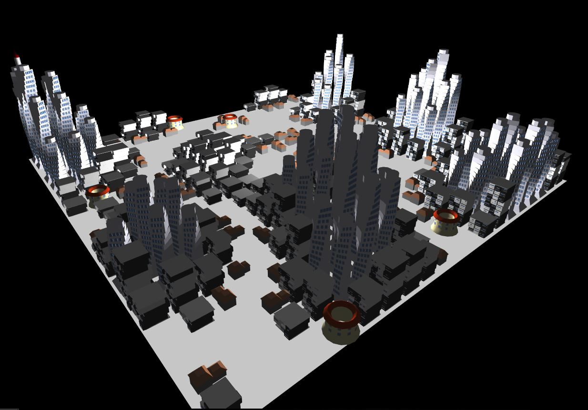|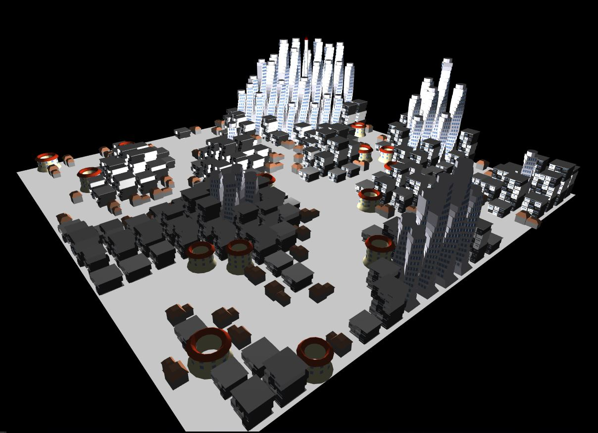|

* You can also use **ShowDensity** checkbox of GUI to watch the density distribution of the city.
  
  |**Density Distribution**|
  |---|
  ||

## Credits:
* [Perlin Noise javascript implementation](https://github.com/josephg/noisejs)
