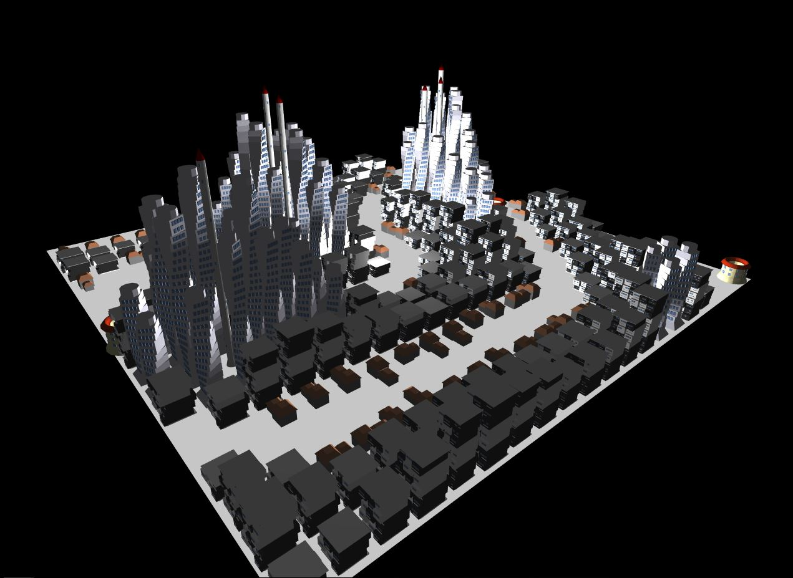
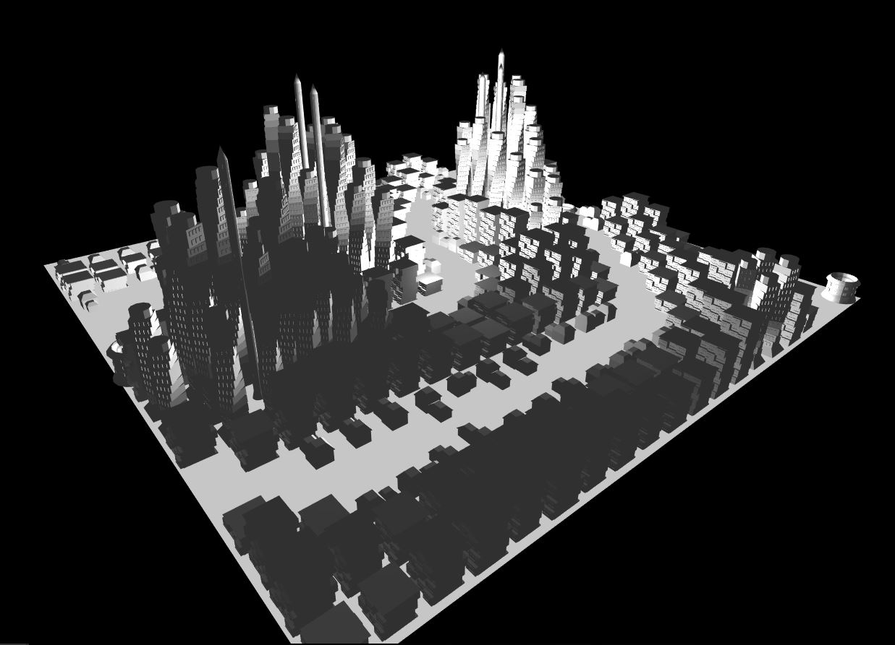
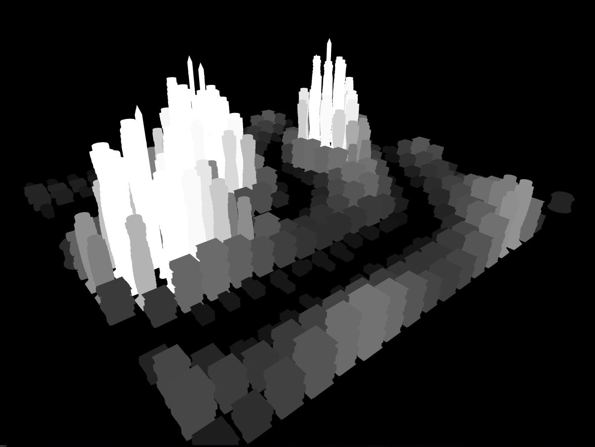
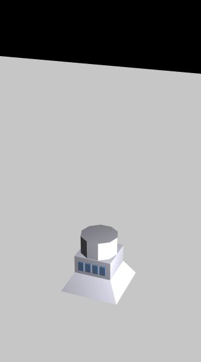
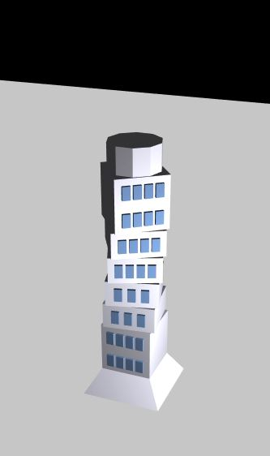
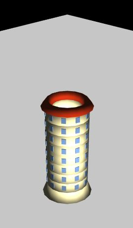
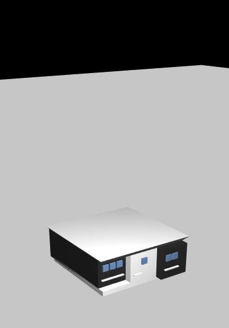
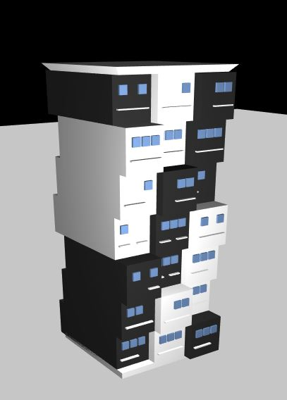

# Procedural City

**University of Pennsylvania, CIS 566**
* Jiawei Wang
* Pennkey: jiaww
* Tested on: Windows 10, i7-6700 @ 2.60GHz 16.0GB, GTX 970M 3072MB (Personal)
___

## Overview
The goal of this project is to model an urban environment using a shape grammar. Although the project is only a one-week work, the details are pretty simple and direct. 
Here are the final results:

|**Final Result(Seed = 24860)**|
|---|
||

|**Without Texture**|**Population Density**|
|---|---|
|||

## Symbol Node
 Symbol node class to include attributes necessary for rendering, such as
``` javascript
class Shape{
    constructor(public predecessor: Shape, public symbol:string, public geometry:string, 
        public pos:vec3, public rot:vec3, 
        public scale:vec3, public xaxis:vec3, public zaxis:vec3){
        this.predecessor = predecessor; // predescessor shape
        this.symbol = symbol; // symbol for rule
        this.geometry = geometry; // geometry for rendering
        this.pos = pos; 
        this.rot = rot;
        this.scale = scale;
        this.xaxis = xaxis;
        this.zaxis = zaxis;
    }
}
```

## Grammar design
* I designed 5 different buildings, they are:
    * Building 1: **Rotating Skyscraper**
        * the model is combined by 4 parts: base, middle, window and roof.
        * the height is decided by the iteration times.
        * the number of the windows for each floor is random(3 or 4).
        * the rotation of each floor is also random.
        
        |**iteration=0**|**iteration>0**|
        |---|---|
        |||
    
    * Building 2: **Circular Mall**
        * the model is combined by 4 parts: base, middle, window and roof.
        * the height is decided by the iteration times.
        * the windows are around its outer surface
        
        |**iteration=0**|**iteration>0**|
        |---|---|
        |||
    
    * Building 3: **Serrated Building**
        * the model is combined by 4 parts: base, middle, window and roof.
        * the height is decided by the iteration times.
        * each middle floor is combined by 3 different parts with different colors.
        * each middle part has 2 rows of different windows 
        
        |**iteration=0**|**iteration>0**|
        |---|---|
        |||   
   
        
    - Eg. A building may be subdivided along the x, y, or z axis into two smaller buildings
    - Some of your rules must be designed to use some property about its location. (10 points)
    - Your grammar should have some element of variation so your buildings are non-deterministic.  Eg. your buildings sometimes subdivide along the x axis, and sometimes the y. (10 points)   
- Write a renderer that will interpret the results of your shape grammar parser and adds the appropriate geometry to your scene for each symbol in your set. (10 points)

## Create a city (30 points)
- Add a ground plane or some other base terrain to your scene (0 points, come on now)
- Using any strategy you’d like, procedurally generate features that demarcate your city into different areas in an interesting and plausible way (Just a uniform grid is neither interesting nor plausible). (20 points)
    - Suggestions: roads, rivers, lakes, parks, high-population density
    - Note, these features don’t have to be directly visible, like high-population density, but they should somehow be visible in the appearance or arrangement of your buildings. Eg. High population density is more likely to generate taller buildings
- Generate buildings throughout your city, using information about your city’s features. Color your buildings with a method that uses some aspect of its state. Eg. Color buildings by height, by population density, by number of rules used to generate it. (5 points)
- Document your grammar rules and general approach in the readme. (5 points)
- ???
- Profit.

## Make it interesting (10)
Experiment! Make your city a work of art.

## Warnings:
If you're not careful with how many draw calls you make in a single `tick()`,
you can very easily blow up your CPU with this assignment. As with the L-system,
try to group geometry into one VBO so the run-time of your program outside of
the time spent generating the city is fast.

## Suggestions for the overachievers:
Go for a very high level of decorative detail!
Place buildings with a strategy such that buildings have doors and windows that are always accessible.
Generate buildings with coherent interiors
If dividing your city into lots, generate odd-shaped lots and create building meshes that match their shape .i.e. rather than working with cubes, extrude upwards from the building footprints you find to generate a starting mesh to subdivide rather than starting with platonic geometry.
